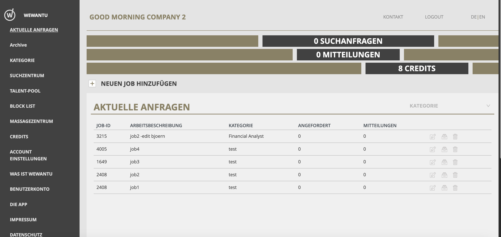
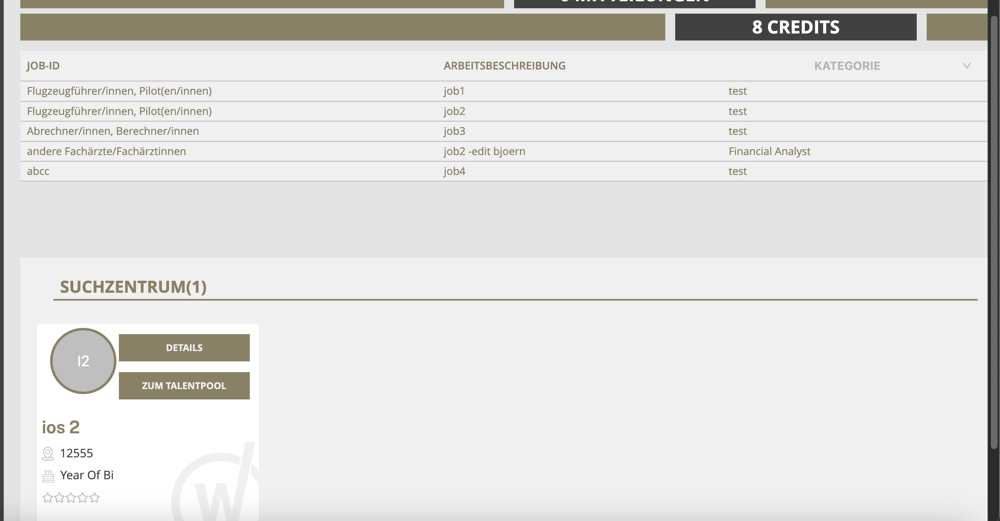
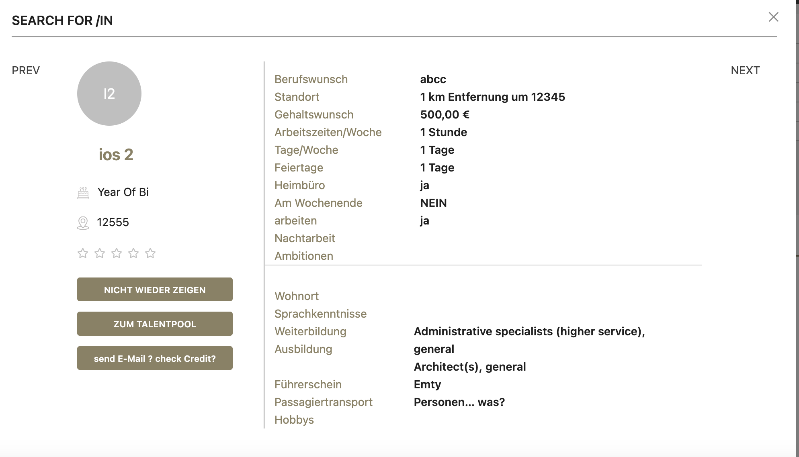
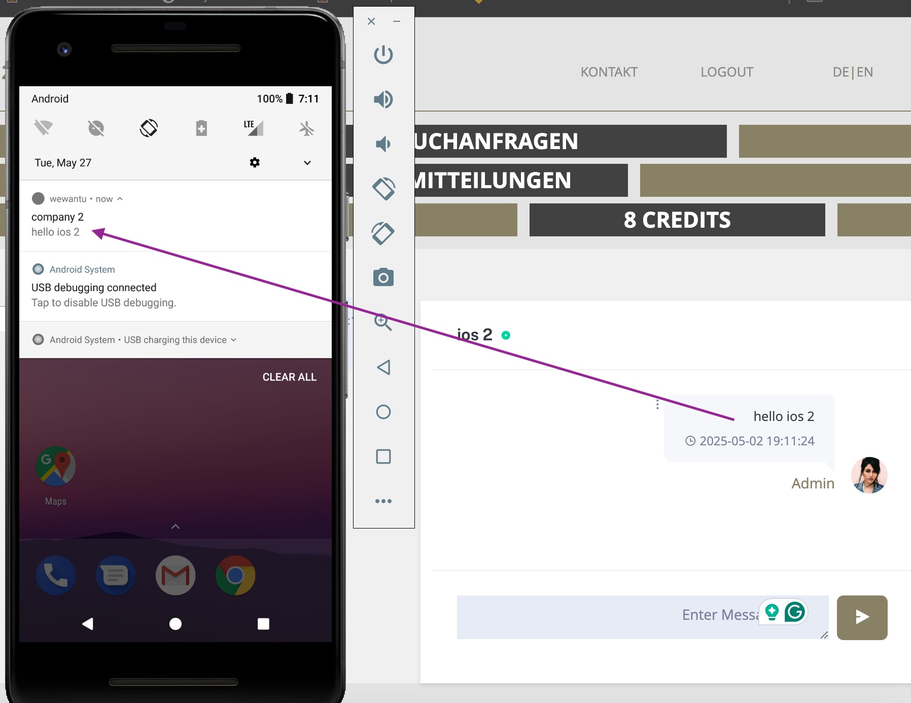

# WeWantu – Frankfurter Freiheit

**WeWantu** is a React.js-based web application developed as part of the [Frankfurter Freiheit](https://frankfurterfreiheit.de/) initiative. The application aims to connect job seekers with potential employers in the Frankfurt area.

## Table of Contents

- [Features](#features)
- [Demo](#demo)
- [Installation](#installation)
- [Usage](#usage)
- [Technologies Used](#technologies-used)
- [Contributing](#contributing)
- [License](#license)

## Features

- User registration and login for job seekers and employers
- Job listings and employer profiles
- Search functionality to find job opportunities by category, keyword, or location
- Real-time chat between job seekers and employers using Firebase
- Responsive design optimized for both desktop and mobile devices

## Demo

Explore the live application here: [https://wewantu.frankfurterfreiheit.de/](https://wewantu.frankfurterfreiheit.de/)

📸 Screenshots
| Page | Description |
|------|-------------|
|  | **Homepage**: Modern, responsive homepage showcasing featured categories, offers, and custom-designed wall decals. |
|  | **Category Page**: Clean grid layout with filters for size, color, theme, and more. Users can easily find the right product. |
|  | **Product Page**: Detailed view with high-resolution images, live color preview, size options, and related products. |
|  | **Shopping Cart**: Simple and intuitive cart system with editable quantities, shipping estimator, and coupon support. |

## Installation

To set up the project locally, follow these steps:

1. **Clone the repository:**

   ```bash
   git clone https://github.com/vunamweb/wewantu.frankfurterfreiheit.git
   cd wewantu.frankfurterfreiheit
   ```

2. **Navigate to the `frontend` directory:**

   ```bash
   cd frontend
   ```

3. **Install dependencies:**

   ```bash
   npm install
   ```

4. **Start the development server:**

   ```bash
   npm start
   ```

   The application will run at `http://localhost:3000`.

## Usage

After starting the development server:

- Open your browser and navigate to `http://localhost:3000`.
- Job seekers can register, browse job listings, and message employers.
- Employers can post jobs and communicate with applicants in real-time.

## Technologies Used

- **React.js** – Front-end library for building user interfaces
- **React Router** – Routing library for React
- **Axios** – Promise-based HTTP client for the browser
- **Firebase** – Backend-as-a-Service for real-time chat and authentication
- **SCSS** – CSS preprocessor for enhanced styling
- **HTML5 & CSS3** – Markup and styling
- **JavaScript (ES6+)** – Scripting language for dynamic functionality

## Contributing

Contributions are welcome! Please follow these steps:

1. Fork the repository
2. Create a new branch: `git checkout -b feature/YourFeature`
3. Commit your changes: `git commit -m 'Add YourFeature'`
4. Push to the branch: `git push origin feature/YourFeature`
5. Open a pull request

Please ensure your code adheres to the project's coding standards and includes appropriate tests.

## License

This project is licensed under the [MIT License](LICENSE).
